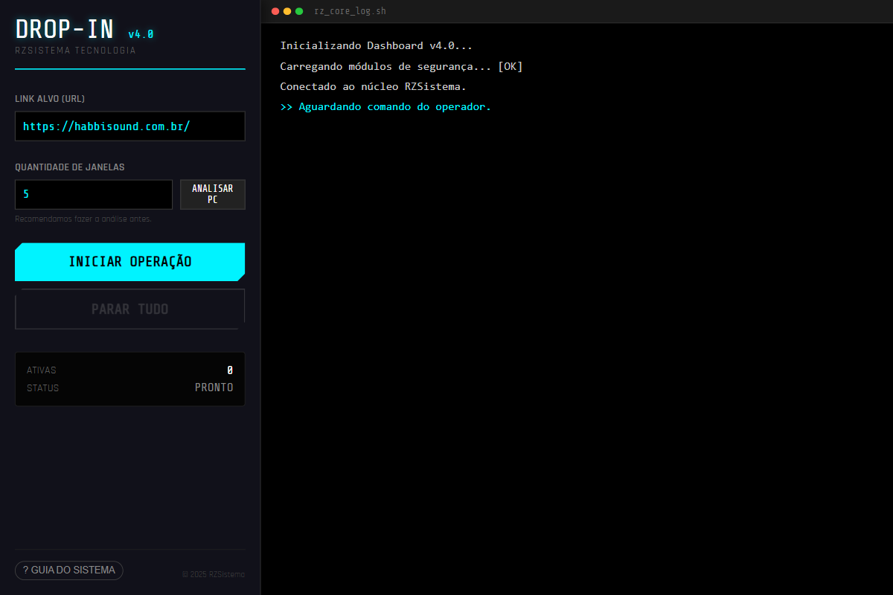

# DROP-IN (v4.0) - RZSistema

> **Automação de Tráfego Profissional & Inteligente**
> Desenvolvido por: **RZSistema Tecnologia**

O **DROP-IN** é uma ferramenta desktop avançada para simulação de tráfego web orgânico. Ele utiliza navegadores reais (via Puppeteer/Electron) para gerar visitas, visualizações e interações humanas em sites alvo, com foco em estabilidade e segurança do hardware.

 
*(Adicione um print da tela v4.0 aqui depois)*

---

## 🚀 Funcionalidades Principais

### 1. **Dashboard Profissional (Split-Screen)**
- Interface dividida ergonomicamente: **Controles** à esquerda, **Terminal de Logs** à direita.
- Logs em tempo real que não são cortados, permitindo monitoramento total da operação.

### 2. **Tecnologia "Smart Queue" & RZ-RAM Guard**
- **Trava de Segurança de RAM**: O sistema monitora a memória do computador em tempo real. Se a memória livre cair abaixo de 800MB, ele **pausa** a abertura de novas janelas automaticamente para evitar travamentos.
- **Análise de Hardware**: Botão dedicado para escanear o PC e sugerir o número máximo seguro de janelas simultâneas.

### 3. **IP Spoofing Visual & Stealth**
- **Rotação de Identidade**: Simula diferentes dispositivos (iPhone, Mac, Windows, Linux) a cada nova janela.
- **Visual IP Tag**: Injeter uma etiqueta visual vermelha (**IP PROTEGIDO**) dentro da página navegada, confirmando visualmente que o mascaramento está ativo.

### 4. **Modo Persistente**
- As janelas permanecem abertas realizando ações humanas (scroll, mouse move) indefinidamente até que o usuário ordene o fechamento.

---

## 📦 Instalação e Uso (Código Fonte)

### Pré-requisitos
- [Node.js](https://nodejs.org/) instalado.

### Passo a Passo
1. **Clone o repositório:**
   ```bash
   git clone https://github.com/RZSISTEMAs/DROP-IN.git
   cd DROP-IN/traffic-bot-gui
   ```

2. **Instale as dependências:**
   ```bash
   npm install
   ```

3. **Rodar em modo de Desenvolvimento:**
   ```bash
   npm start
   ```

4. **Gerar Executável (.exe):**
   Para criar a versão final distribuível (v4.0):
   ```bash
   npm run package
   ```
   *O executável será gerado na pasta `Drop-In-v4.0-win32-x64`.*

---

## 🛠 Estrutura do Projeto

- **`traffic-bot-gui/`**: Contém todo o código da aplicação Electron.
  - **`main.js`**: Cérebro do sistema. Gerencia processos, Puppeteer, e regras de segurança (RAM).
  - **`renderer.js`**: Lógica da interface (botões, inputs, comunicação com main).
  - **`index.html`**: O Dashboard visual (Split-Screen).
  - **`style.css`**: Estilização Cyberpunk/Neon.

---

## 🔒 Aviso de Responsabilidade
Esta ferramenta foi desenvolvida para testes de carga, verificação de analytics e automação controlada. O uso indevido para ataques DDoS ou fraudes é de total responsabilidade do usuário.

---
© 2025 RZSistema - Todos os direitos reservados.
